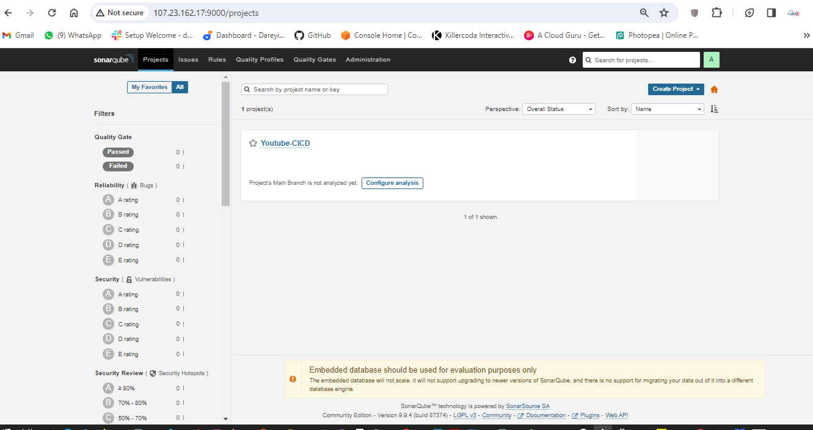
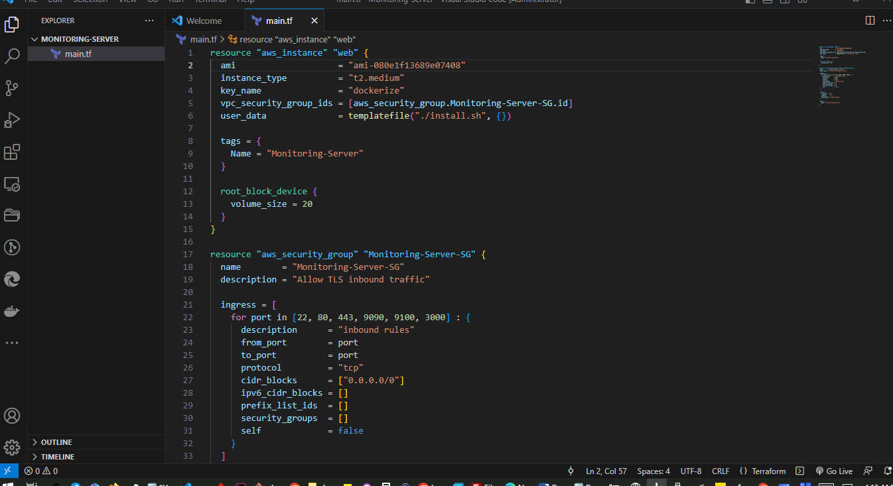
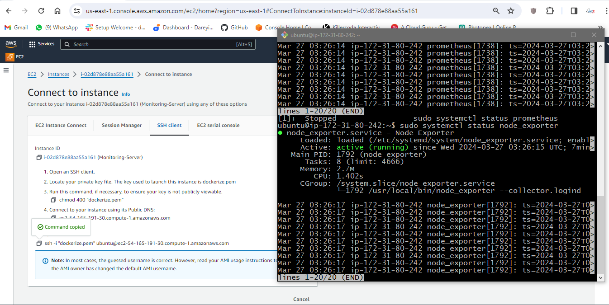
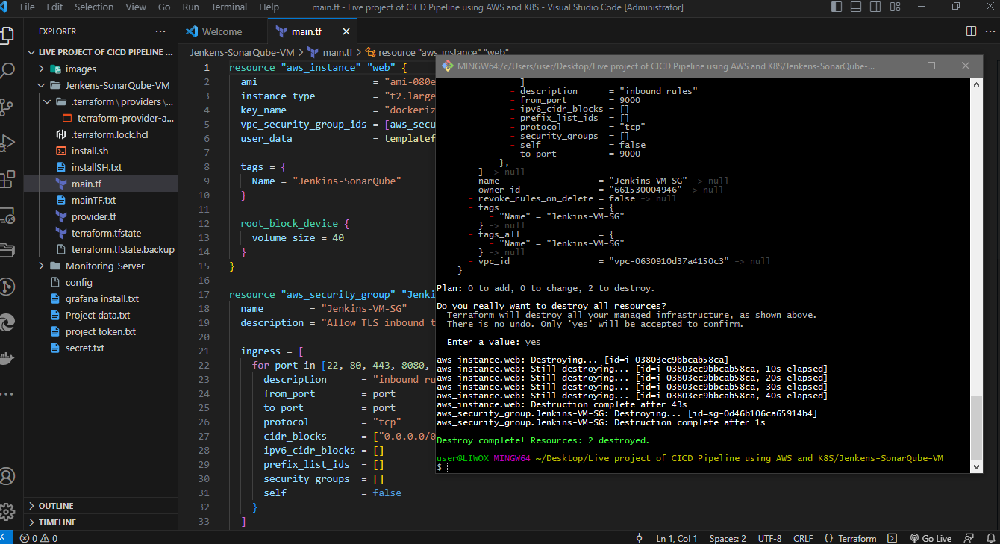

# **DevOps CI CD Pipeline using AWS and K8S**

In this live project, I will create a complete DevOps project using
Jenkins, SonarQube, Trivy, Docker, and Kubernetes.

This CI/CD pipeline will work in a completely automated manner; any
change on the GitHub repository will trigger the pipeline. Once pipeline
execution is complete, you will see the changes appearing on the
application, which we will deploy on Kubernetes.

## **Project Summary**


---
The image above defines the architecture of this project. So lets explain it. 
First of all, we will use Terraform to create the instance for Jenkins,
and all the packages we will install in that instance using Terraform
itself. In our CI/CD pipeline, if a user makes any change on the GitHub
repository, it will trigger the pipeline. Our pipeline will start
executing the stages. First of all, it will do the SonarQube analysis of
our code, then it will perform the npm dependencies installation, and
then it will do the Trivy scan of our code. Next, it will build the
Docker image and push that Docker image to the Docker Hub. Then, it will
scan that Docker image using Trivy. Finally, our Jenkins script will
deploy the pods on Kubernetes using the Docker image, and we will have
the monitoring configured using Prometheus and Grafana, which will
monitor the EKS cluster. It will also monitor Jenkins. After completion
of every build, we will get the email notification on our Gmail ID with
the Trivy scan results and the complete log of the job completed.

here is the the code (youtube clone app) on my github https://github.com/ArmstrongLiwox/a-youtube-clone-app

**So let\'s start building our project.**

On my Windows 10 system I have Termius (I can also use Gitbash
terminal), Visual Studio Code and the AWS CLI installed.

You can download and install to follow along.


I will create the folder for my project, and inside it, I will create
one more folder called \"Jenkins-SonarQube-VM.\"


### Create main.tf file

On the Visual Studio Code, I will open the folder which I have created,
and on this folder \"Jenkins-SonarQube-VM,\" I will create one file
\"main.tf,\".


I will paste this content for the main.tf 
```
resource "aws_instance" "web" {
  ami                    = "ami-080e1f13689e07408"      
  instance_type          = "t2.large"
  key_name               = "dockerize"            
  vpc_security_group_ids = [aws_security_group.Jenkins-VM-SG.id]
  user_data              = templatefile("./install.sh", {})

  tags = {
    Name = "Jenkins-SonarQube"
  }

  root_block_device {
    volume_size = 40
  }
}

resource "aws_security_group" "Jenkins-VM-SG" {
  name        = "Jenkins-VM-SG"
  description = "Allow TLS inbound traffic"

  ingress = [
    for port in [22, 80, 443, 8080, 9000, 3000] : {
      description      = "inbound rules"
      from_port        = port
      to_port          = port
      protocol         = "tcp"
      cidr_blocks      = ["0.0.0.0/0"]
      ipv6_cidr_blocks = []
      prefix_list_ids  = []
      security_groups  = []
      self             = false
    }
  ]

  egress {
    from_port   = 0
    to_port     = 0
    protocol    = "-1"
    cidr_blocks = ["0.0.0.0/0"]
  }

  tags = {
    Name = "Jenkins-VM-SG"
  }
}

```

### lets explain the main.tf file

The main.tf file will contain details for the infrastructure I intend to
provision on my AWS console like:

-   The AMI; you need to change it as per your region.

-   Instance type I\'m going to create T2 large.

-   key name,

-   Name for the Linux server.

-   The user data file \"install.sh,\" which it will run inside the
    created EC2 instance.

-   Name to the EC2 instance \"Jenkins-SonarQube.\"

-   Volume size of which we will be using 40gb,

-   The security group.

I will log in to my AWS to get some data (AMI for my instance) to update my main.tf file.


We will use the default VPC for this project. So we don\'t need to create the custom VPC.


Once again, it will just associate these Security Groups to the default VPC of the account, and it is also going to open the inbound ports 22, 80, 443,

8080 for the Jenkins,

9000 for the SonarQube, and

3000 for our application.

I will save this file. 

I will now create one more file \"provider.tf,\" and I will provide the content in this file.

```
terraform {
  required_providers {
    aws = {
      source  = "hashicorp/aws"
      version = "~> 5.0"
    }
  }
}
# Configure the AWS Provider
provider "aws" {
  region = "us-east-1"     #change region as per you requirement
}

```


Here, actually, we are defining, we are registering the provider, which
is the AWS. This is my region us-east-1. I will save this file.

And finally, I will create the \"install.sh\" file, which it is going to run inside the created EC2 instance.

```
#!/bin/bash
sudo apt update -y
wget -O - https://packages.adoptium.net/artifactory/api/gpg/key/public | tee /etc/apt/keyrings/adoptium.asc
echo "deb [signed-by=/etc/apt/keyrings/adoptium.asc] https://packages.adoptium.net/artifactory/deb $(awk -F= '/^VERSION_CODENAME/{print$2}' /etc/os-release) main" | tee /etc/apt/sources.list.d/adoptium.list
sudo apt update -y
sudo apt install temurin-17-jdk -y
/usr/bin/java --version
curl -fsSL https://pkg.jenkins.io/debian-stable/jenkins.io-2023.key | sudo tee /usr/share/keyrings/jenkins-keyring.asc > /dev/null
echo deb [signed-by=/usr/share/keyrings/jenkins-keyring.asc] https://pkg.jenkins.io/debian-stable binary/ | sudo tee /etc/apt/sources.list.d/jenkins.list > /dev/null
sudo apt-get update -y
sudo apt-get install jenkins -y
sudo systemctl start jenkins
sudo systemctl status jenkins

##Install Docker and Run SonarQube as Container
sudo apt-get update
sudo apt-get install docker.io -y
sudo usermod -aG docker ubuntu
sudo usermod -aG docker jenkins  
newgrp docker
sudo chmod 777 /var/run/docker.sock
docker run -d --name sonar -p 9000:9000 sonarqube:lts-community

#install trivy
sudo apt-get install wget apt-transport-https gnupg lsb-release -y
wget -qO - https://aquasecurity.github.io/trivy-repo/deb/public.key | gpg --dearmor | sudo tee /usr/share/keyrings/trivy.gpg > /dev/null
echo "deb [signed-by=/usr/share/keyrings/trivy.gpg] https://aquasecurity.github.io/trivy-repo/deb $(lsb_release -sc) main" | sudo tee -a /etc/apt/sources.list.d/trivy.list
sudo apt-get update
sudo apt-get install trivy -y
```


### lets explain the install file

So, this \"install.sh\" file will first update the packages, then it
will install the JDK, then it will install the Jenkins in our EC2
instance.

It will then it will install the Docker in that instance, and then it
will run the SonarQube as the container in the EC2 instance.

This is the image name for the SonarQube

docker run -d \--name sonar -p 9000:9000 sonarqube:lts-community

Which is the standard image of the SonarQube.

And after that, it will install the Trivy in that EC2 instance. I will
save this file also.

Note that The path has been specified within our main.tf file.

### **Use AWS CLI**

On the terminal.I already have my AWS credentials. I will check the
users I have.


I will give the command \"***AWS configure***\". I will paste the access
key and hit enter. I will paste the secret key also and hit enter. So,
we have successfully logged in from the terminal.


Now I will check for terraform on my PC. It shows its outdated so I will download the recent and check again. 

So now I will use gitbash because my VScode integrated terminal is not working.


On the VS Code, I\'m inside this folder. I will give the command

\"***terraform init***.\"


Okay, so Terraform has been initialized in this folder. I will now give
the command

\"***terraform plan.\"***


Okay, so it is going to create these resources in our AWS account.

Finally, I will give the command \"***terraform apply
-auto-approve***.\"


Instance created. If I go to the AWS console, instances, the region us-east-1, we will see the instance which has been created, the security group and the inbound rules which have been applied as per the Terraform script.


I will then SSH into my instance by clicking on connect and copying the SSH string and paste into my git bash terminal.


I am inside my ec2 instance now. I will give the command
\"***jenkins-version***,\" so Jenkins has been installed on my system. I will give the command \"***docker-version***,\" so Docker is also
installed.

I will also give the command \"***trivy-version***,\" so this is the version of the Trivy which has been installed on my system. If I give the command \"**docker-ps -a**,\" we will see the container for the SonarQube which is running. Created about a minute ago.


We are actually running the SonarQube as the container on this EC2
instance. 

>You might be doing this project in multiple settings, so while
you are shutting down your EC2 instance, you need to first stop the
Docker container first. Give this command \"***docker ps -a***,\" you
will get the ID for the container, and then give the command \"***docker
stop***\" and the container ID. After that, you can shut down this EC2
instance, and once you are back, you need to give give the command
\"***docker start***\" and the container ID to restart the SonarQube.

## **Configure Jenkins**

We have installed the EC2 instance for Jenkins and SonarCube. Now we
need to configure Jenkins on that EC2 instance. I will browse the public
IP of the instance with port 8080, go to this path on the terminal, and
copy the suggested password for installation.


Install suggested plugins and I will create the user \"Cloud admin\" and
set the password.


Okay, so we are inside the Jenkins dashboard now. We need to install a few plugins required for our project. 

I will go to \"Manage Jenkins\" \> \"Manage Plugins\" \> \"Available\" and install the following plugins:

\- Eclipse Timing Installer

\- SonarQube Scanner

\- Sonar Quality Gates

\- NodeJS

\- Docker (Docker Commons, Docker Pipeline, Docker API, Docker Build
Step)


Now we will install some tools required for this project. I will go to
\"Manage Jenkins\" \> \"Global Tool Configuration\" and add the
following tools:

\- NodeJS 16

\- JDK 17

\- Docker


Next, under \"Manage Jenkins,\" I will add the SonarCube server with the
appropriate settings.


## **Configure SonarCube**

Now it\'s time to configure SonarCube. I will copy the public IP of the
instance and browse it with port 9000.


Provide the default credentials, set a new password, and update tokens
for Jenkins.


Then I will create a token for SonarCube and add it to Jenkins
credentials.


Finally, we need to integrate SonarCube with Jenkins by adding the
SonarCube server under \"Manage Jenkins\" \> \"Configure System.\"


Go to quality gates on SonarCube dashboard and create


Now we have to create the webhook between SonarCube abd Jenkins.


We have configured Jenkins and SonarCube and integrated them. Now it\'s time to create the pipeline. First, I will create a token for our
project in SonarCube. Then, in the Jenkins dashboard, I will create a new item with the required pipeline script.


## **Create pipeline in Jenkins**


> Click on Discard old builds

> Max number of builds to keep 2





## **Create pipeline**

Next, we need to configure our pipeline to build a Docker image and push
it to Docker Hub. For this, we need to create a personal access token on
Docker Hub and add it to Jenkins credentials. Then, we add stages in our
Jenkins pipeline script to build, tag, push, and scan the Docker image.


# **Set up Prometheus and Grafana**

In this section of the project, we will set up monitoring with Prometheus and Grafana by creating a separate instance. Using Terraform, we create the necessary resources and run commands to install Prometheus, node exporter, and Grafana. After setting up, we configure Prometheus to include the node exporter job and check Grafana to visualize the metrics.

## Create a main.tf file

```
resource "aws_instance" "web" {
  ami                    = "ami-080e1f13689e07408"      
  instance_type          = "t2.medium"
  key_name               = "dockerize"              
  vpc_security_group_ids = [aws_security_group.Monitoring-Server-SG.id]
  user_data              = templatefile("./install.sh", {})

  tags = {
    Name = "Monitoring-Server"
  }

  root_block_device {
    volume_size = 20
  }
}

resource "aws_security_group" "Monitoring-Server-SG" {
  name        = "Monitoring-Server-SG"
  description = "Allow TLS inbound traffic"

  ingress = [
    for port in [22, 80, 443, 9090, 9100, 3000] : {
      description      = "inbound rules"
      from_port        = port
      to_port          = port
      protocol         = "tcp"
      cidr_blocks      = ["0.0.0.0/0"]
      ipv6_cidr_blocks = []
      prefix_list_ids  = []
      security_groups  = []
      self             = false
    }
  ]

  egress {
    from_port   = 0
    to_port     = 0
    protocol    = "-1"
    cidr_blocks = ["0.0.0.0/0"]
  }

  tags = {
    Name = "Monitoring-Server-SG"
  }
}

```



## Create a provider.tf file

```
terraform {
  required_providers {
    aws = {
      source  = "hashicorp/aws"
      version = "~> 5.0"
    }
  }
}
# Configure the AWS Provider
provider "aws" {
  region = "us-east-1"     #change region as per you requirement
}

```


## Create a install.sh file

```
#!/bin/bash
sudo apt update -y

##Install Prometheus and Create Service for Prometheus
sudo useradd --system --no-create-home --shell /bin/false prometheus
wget https://github.com/prometheus/prometheus/releases/download/v2.47.1/prometheus-2.47.1.linux-amd64.tar.gz
tar -xvf prometheus-2.47.1.linux-amd64.tar.gz
cd prometheus-2.47.1.linux-amd64/
sudo mkdir -p /data /etc/prometheus
sudo mv prometheus promtool /usr/local/bin/
sudo mv consoles/ console_libraries/ /etc/prometheus/
sudo mv prometheus.yml /etc/prometheus/prometheus.yml
sudo chown -R prometheus:prometheus /etc/prometheus/ /data/
sudo cat > /etc/systemd/system/prometheus.service << EOF
[Unit]
Description=Prometheus
Wants=network-online.target
After=network-online.target

StartLimitIntervalSec=500
StartLimitBurst=5

[Service]
User=prometheus
Group=prometheus
Type=simple
Restart=on-failure
RestartSec=5s
ExecStart=/usr/local/bin/prometheus \
  --config.file=/etc/prometheus/prometheus.yml \
  --storage.tsdb.path=/data \
  --web.console.templates=/etc/prometheus/consoles \
  --web.console.libraries=/etc/prometheus/console_libraries \
  --web.listen-address=0.0.0.0:9090 \
  --web.enable-lifecycle

[Install]
WantedBy=multi-user.target
EOF
sudo systemctl enable prometheus
sudo systemctl start prometheus

##Install Node Exporter and Create Service for Node Exporter
sudo useradd --system --no-create-home --shell /bin/false node_exporter
wget https://github.com/prometheus/node_exporter/releases/download/v1.6.1/node_exporter-1.6.1.linux-amd64.tar.gz
tar -xvf node_exporter-1.6.1.linux-amd64.tar.gz
sudo mv node_exporter-1.6.1.linux-amd64/node_exporter /usr/local/bin/
rm -rf node_exporter*
sudo cat > /etc/systemd/system/node_exporter.service << EOF
[Unit]
Description=Node Exporter
Wants=network-online.target
After=network-online.target

StartLimitIntervalSec=500
StartLimitBurst=5

[Service]
User=node_exporter
Group=node_exporter
Type=simple
Restart=on-failure
RestartSec=5s
ExecStart=/usr/local/bin/node_exporter --collector.logind

[Install]
WantedBy=multi-user.target
EOF
sudo systemctl enable node_exporter
sudo systemctl start node_exporter

##Install Grafana
$ sudo apt-get update
$ sudo apt-get install -y apt-transport-https software-properties-common
$ wget -q -O - https://packages.grafana.com/gpg.key | sudo apt-key add -
$ echo "deb https://packages.grafana.com/oss/deb stable main" | sudo tee -a /etc/apt/sources.list.d/grafana.list
$ sudo apt-get update
$ sudo apt-get -y install grafana
$ sudo systemctl enable grafana-server
$ sudo systemctl start grafana-server
```


```
Terraform init
```


```
Terraform plan
```


```
terraform apply -auto-approve
```


Check AWS to see new instance


Access new instance


```
sudo systemctl status Prometheus
```


```
sudo systemctl status node_exporter
```



```
sudo systemctl status grafana-server
```


Go to public IP on port 9090


On the terminal go to

```
cd /etc/prometheus
```

```
sudo nano prometheus.yml
```
```
add node-exporter job
```

static_configs:
```
\- targets: \[\"localhost:9090\"\]

\- job_name:\'node_exporter\'

static_configs:

\- targets: \[\"54.165.191.30:9100\"\]
```


## Check indentation 

```
promtool check config /etc/prometheus/prometheus.yml
```


## Reload the Prometheus configuration
```
curl -X POST http://localhost:9090/-/reload
```


## Check for node exporter on dashboard


## Access grafana with the public IP on port 3000


## Change default password


## Login


### We have to set the data source


## Load and select the source which we have created: Prometheus.


> Import so we can see the dashboard for our monitoring server using the Node Explorer. Multiple dashboards are available.


Multiple dashboards are available


> Now we need to integrate Jenkins with Prometheus so that we can import the dashboard for Jenkins also on Grafana. So I will go to Jenkins -\>
Manage Jenkins -\> Available plugins. I will search for \"Prometheus\"
and select the plugin \"Prometheus Matrix\" and click on install. It is
asking to restart, so I will restart Jenkins.


> Login again, go to Manage Jenkins -\> System, and under the system, the Prometheus path is Prometheus. I will take these two options also and the job name is Jenkins job. I will click on apply and save.


> I will go to the terminal of the server and again go to CD -\> Etc -\>
Prometheus. I will open the prometheus.yml file and add the job for the
Jenkins job. I will save this file.


I will run the command to check the indentation of the YAML file.
```
promtool check config /etc/prometheus/prometheus.yml
```


Now it is successful. I will reload this service. If I go to Prometheus dashboard and do the refresh,  Jenkins job is added. Data fetching may
take some time. See the target is up, and the log is coming.


Now we need to add the dashboard for Jenkins on Grafana. I will go to Grafana dashboard and search for \"import dashboard\" and type the dashboard ID 9964.


I have given the ID for the dashboard. I will load it. The name of the dashboard is taken. I will select the source Prometheus and import. This is the dashboard for the Jenkins executor.


Now to go to Jenkins. I will go to job and I will click on build.


Now the job is completed. If I go to Grafana dashboard and do the refresh, the successful job is showing as one. After integrating Jenkins with Grafana, we have the successful job quantity as one.


## **Send email notification through jenkins**

In this section of the project, we need to create the email alert for
our job in Jenkins. So I have logged into my Google account and I\'m
inside my account.google.com.


Your gmail account must have the two-factor authentication enabled. I will go to Security -\> App password. I will give the name and click on create.
I will copy this to my system and close.


Now we need to enter these credentials into Jenkins. So I will go to Jenkins -\> Manage Jenkins -\> Manage credentials. Add credentials -\> Username with password. Username is my Gmail address and I will provide the created password. Here ID I will give Gmail, description I will give Gmail and I will click on create.


Now I will go to Manage Jenkins -\> System and I will go to Email
settings. SMTP server I will provide smtp.gmail.com. Default user I will
provide my email address. I will go to Advanced -\> Use SMTP
Authentication. Username I will provide my username and password which
we have created.


I will again click on test configuration. Email was sent successfully.
If I go to my Gmail, I have received the test email from the Jenkins.


I will now go to Extended Email Notification -\> Server. I will give SMTP.gmail.com, Port 465 Advanced. Credentials I will select the credentials which we have created (Gmail). Use SSL, default content type I will select HTML. Under the triggers, I will select \"always\" and \"success\".


Apply and then save.

Now we need to modify the pipeline script and we need to give the post.
So I will go to my pipeline -\> Configure. I will go to Script and after
the stages, I will provide the post.


I will click on apply and save. I will click on build.


Now the job completed successfully and if I go to my Gmail account, I
have received the email from the pipeline which has the complete build
log along with the Trivy file scan result and Trivy image scan
result.


## **Configure AWS EKS cluster**

In this section of the project, we are going to configure the AWS EKS. I have taken the remote of the Jenkins SonarQube server. First of all, I need to install the kubectl in this server. So I will give the command to install the URL. Then I will download the package for the kubectl, then I will install it. If I give the command kubectl version, this is the version of the kubectl which has been installed.


Now I will go ahead and install the AWS CLI in this server. First of
all, I will download the packages for the AWS CLI. I will install the
unzip in this server. I will unzip the downloaded package and then I
will install the executable file. If I give the command AWS \--version,
this is the version of the AWS CLI installed in my system.


## Install the eksctl
Now we need to install the eksctl. So first of all, I will download the packages for the eksctl using this command ( ). These packages have been downloaded in the TMP folder. So I will go to the TMP directory and I will move the executable file to the bin folder because all the executable files are under the bin. If I give the command eksctl version, eksctl has been installed in my system.


## Attach IAM role to instance

Now we need to create the IAM role and attach it to the EC2 instance. So on my AWS console, I will go to IAM -\> Roles -\> Create Role. AWS service in the dropdown, I will select EC2. Next, I will select the
AdministratorAccess. Next, I will give the name \"eksctl_role\". Create.


{width="7.5in"
height="3.8493055555555555in"}

{width="7.5in"
height="3.8541666666666665in"}

{width="7.5in"
height="3.8305555555555557in"}

So the role has been created. I will go to my EC2 instance, I will go to Action -\> Security -\> Modify IAM role and in the dropdown, I will select the created role. Update IAM role.


Okay, so role has been assigned to the EC2 instance.


## Create EKS cluster

Now I will go ahead and create the EKS cluster using the eksctl. So I will give the command in which this would be the name of my EKS cluster. I will hit enter, then I will select my region AP South one, then I will give the node type T2 small, then I will give the node count 3.


This Kubernetes cluster creation will take some time. We 'll have to give it a wait Kubernetes cluster creation completed.


If I give the command kubectl get nodes, these are three nodes created in my cluster. If I give the command kubectl get SVC, this is the default service of my Kubernetes cluster.


## Integrate Prometheus with EKS and Import Grafana Monitoring Dashboard for Kubernetes

Now we need to configure the monitoring for our Kubernetes cluster. So we will install the Prometheus on the EKS cluster and then we will add the Prometheus as a source to the Grafana dashboard. So to install the Prometheus, first of all, we need to install the Helm on the server. So I will install the Helm. If I give the command helm \--version, so the
Helm has been installed in my system.


Now we need to add the Helm stable charts for our local client. So for that, I will give the command. Then I will add the Prometheus Helm repo.
Then I will go ahead and create the separate namespace for the Prometheus and then finally, I will go ahead and install the Prometheus using Helm. Okay, so it has been installed. I will now give the command
to check if Prometheus has been installed or not. If I give the kubectl command, these are the pods created for the Prometheus. Then I will check the service which has been created for the Prometheus. So this is the service created for the Prometheus, but these are not the load balancer.


So I will give you the cube CDL command \`ql get PS\` namespace Prometheus so these are the ports created in the for the Prometheus. Then I will check the service which has been created for the Prometheus
so this is the service created for the Prometheus.

But these are not the load balancer service so these are not exposed to the external world so to expose the service to the external world I will open the file and in this file I will go to end and here type is given as cluster IP


I will make it load balancer and then this port I will make 9090 I will go ahead and save this file I will press escape button then colum WQ and hit enter if again give the command to check the service so now you can see we have the load Balan service instead of cluster IP and this is the external DNS for the service I will copy this URL and on the browser I will
browse it with the port 9090.


So you can see Prometheus is ready and it has been installed on the kubernetes cluster I can check the targets here for our kubernetes cluster.


Okay now we need to add this Prometheus as the data source in the grafana so I will go to our grafana  server and on the left side I will go to connections data sources and we have one data source which is our Prometheus server which is installed in the ec2 instance I will add one more Prometheus as the data source which has been installed on the kubernetes cluster so I will type here I will click here add new data source Prometheus name I will give Prometheus URL I will give HTTP column 9090 and here I will
click on Save and test.


So connection successful okay so data source has been added now we need to import the dashboard for the kubernetes cluster so I Will Show You by adding the two dashboards you can uh search for the dashboard ID and you can uh import the multiple dashboards for the kubernetes so here I will go to search and I will go to import dashboard and here I will give the ID for one of the dashboard 15760.


I will click on load so this is the name of the dashboard kubernetes pods and the data source I will select Prometheus EAS and I will click on import.


So this is the dashboard for our e data fetching may take some time and here on the data source in the drop down we need to select our data source fromus e so CP usage by container CP usage by memory usage by
container all the graphs are available here if I select the name space
space I will go to home of the dashboard so these are the dashboards
which has been imported to our uh grafana I Will Show You by importing
one more dashboard which is also for the kubernetes.

{width="7.5in"
height="4.022916666666666in"}

{width="7.5in"
height="3.9583333333333335in"}

{width="7.5in"
height="3.8229166666666665in"}

So in the search bar I will go to import dashboard and here I will give
the ID 17119 and I will click on load

{width="7.5in"
height="3.9131944444444446in"}

so name of the uh dashboard is kubernetes e cluster I will select the
data source Prometheus e and import

{width="7.5in"
height="3.9784722222222224in"}

{width="7.5in"
height="3.8625in"}

So here we can monitor complete cluster so we can monitor the name space
Prometheus here you can search for the dashboard IDs and you can import
the more dashboards regarding the kubernetes cluster to the grafana so
on our grafana we have total four dashboards as of now one one is for uh
genkins and one is for node exporter which is the local host and two are
for the EKS

{width="7.5in"
height="3.8673611111111112in"}

{width="7.5in"
height="3.83125in"}

## Configure Jenkins Pipeline to Deploy Application on AWS EKS

Now finally we need to configure our Jenkins pipeline to deploy the resources on the kubernetes. For that we need to first deploy some plugins to the Jenkins. I will go to man Jenkins plugins, available plugins and I will search here kubernetes. I will select the required plugins. a total of four plugins I have selected and I will click on install.


 I will go to home I will go to terminal of the server and I'm inside the home directory. Inside you can see a directory .kube. I will go to this directory and this is the config file for the kubernetes I will right click and download it to my PC. I will save it on my project folder.


I will go to that folder and I will open the config file in the notepad and I will do the save a copy and I will give the name secret.txt 


Now we need to add these secrets to the jenkins so on the jenkins I will go to manage Jenkins, credentials, add credentials, and I will select secret file ID. I will give it kubernetes and I will choose the file which we have just downloaded and the ID is kubernetes this ID we will recall in the pipeline script.


I will now go to my pipeline, configure. I will go to script and here we need to add one more stage to deploy the resources on the kubernetes so here I will add the one more stage and the name is deploy to kubernetes.


We need to generate the command within the script. Go to the kubernetes directory inside our GitHub repository, kubernetes, where we have the Manifest files.


I will generate the command command here. so to generate the command I will go to pipeline syntax which will open the new tab and here in the drop down select the plugin which we had installed Cube CTL credential select the kubernetes credential and leave the remaining parameters as it is.


Generate pipeline script copy this command and paste it on the pipeline script. I will click on apply and save .


While pushing the changes to the remote repository from your Git Bash you may need the GitHub personal access token to be provided. so on the GitHub, you can go to setting, developer setting, personal access token, token classic, and you can create your token.


I have already created the token for myself self I will clone the repository on my Git hub.


So I'm inside my repository before we verify our pipeline we need to enable the web hook for our pipeline so I will go to configure and do it. I will name it GitHub project, I will paste the URL for my repository and under the build trigger I will select this option GitHub hook trigger.


And I will go to my repository on the GitHub I will go to setting web hooks, add web hook, I will give the URL here HTTP colon sl/ and the public IP of the Jenkins instance colon 8080. GitHub hyphen web hook slash ADD web hook.


I will refresh here it is showing as green means connection is successful 


On my project I will apply and save. okay so everything has been set up now it's time to verify our Dev SEC pipeline if I go to dockerhub you can see there is only the old image for YouTube clone app.


I will modify the Readme file. I will add “verify build”to the test 50. Save and exit. I will do my git add, git commit, and get push origin main. so changes have been pushed to remote repository. 


If I go to my Jenkins job so it has triggered automatically upon the change on the Git Repository. for job completed successfully.


 If I go to dockerhub and do the refresh here so image has been pushed just now 


And if I go to my email I have received the email alpng with the log from the pipeline. 


If I go to my Grafana dashboard, I will go to the pods I will select my source and the name space is default so data is fetching for the newly created Pods. 


If I go to server and give the command Cube CTL get service we will see the URL of my pod 

```
A6fd63f4bd9a1444697854cb7ae37515-1773339573.us-east-1.elb.amazonaws.com
```


I will browse the link on a new tab. so this is my application running. This is the YouTube clone app. you can play the videos also on this app. we will verify it once again on the application. the color of these symbols is blue of which we will change it to some other color and will verify it changes or not.


So on the G bash I will go to SRC directory. I will go to components and I will open the file sidebar in the vim editor. We will change the color of the side bar icons from blue color to red color. I will send the changes to the remote repository get push origin main. 


If I go to my pipeline the job has been triggered upon the change on the GitHub repository job completed successfully 


When I go to terminal and give here the command Cube CTL get PS we will see the new newly created pods. We will check these pods on the Grafana dashboard.


On the grafana dashboard, namespace default in the drop down I will select the Pod, and if I do a refresh you see data is fetching for the newly created pod.


When I go to my application and do the refresh here so you can see the change has color has been changed for these icons from blue to red


This way you can create the complete automated DevSecOps CICD pipeline which will trigger automatically upon the change on the GitHub repository and once job is completed you will see the changes appearing on the application.

# Clean up


Delete all the pods in prometheus namespace
```
kubectl delete --all pods -n prometheus                   
```


```
kubectl delete namespace prometheus
```


Show the all the deployments, pods & services in default namespace.

```
kubectl get all
```


Delete deployment in your k8s cluster

```
kubectl delete (name of deployment)
```


Delete service for your deployment of k8s cluster
```
kubectl delete service/virtualtechbox-service
```
Delete your EKS cluster
```
eksctl delete cluster virtualtechbox-cluster --region us-east-1
```
```
eksctl delete cluster --region=us-east-1 --name=virtualtechbox-cluster
```


```
terraform destroy
```





```
terraform destroy
```


